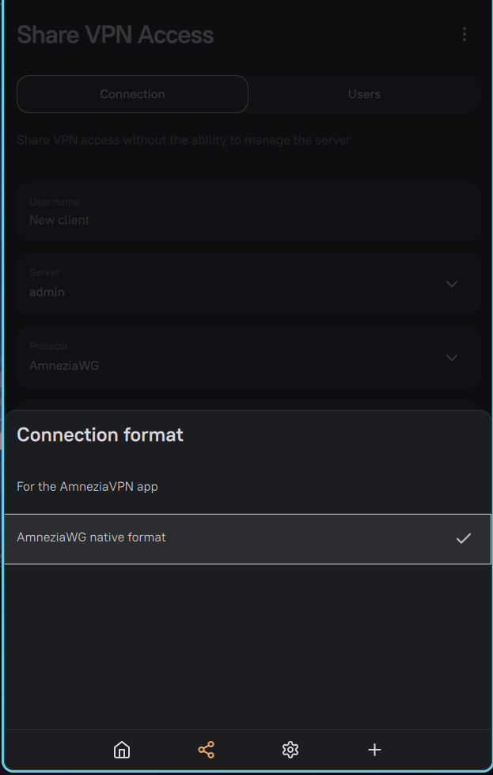

# Как правильно использовать AmneziaWG 2.0 через консоль (awg-quick)*

### 1. Как получить правильный нативный конфиг из админки / клиента

1. Зайди в AmneziaVPN (legacy или новый) → выбери сервер AmneziaWG 2.0.
2. Нажми на шестерёнку ⚙️ рядом с сервером.
3. Выбери **«Экспорт конфигурации»** → **«AmneziaWG native format»** 
4. Сохрани файл, например как `awg-v2.conf`.



**Важно:**  
- Никогда не используй «Поделиться» → `vpn://...` строку.  
- Используй только **нативный .conf**.

### 2. Что обязательно нужно править в конфиге AmneziaWG 2.0

Текущая версия `amneziawg-tools` **не любит** пустые или нулевые:
```ini
 I2= 
 I3= 
 I4= 
 I5=
```
**Правило простое:**

- Оставляй **только** заполненный `I1=…`
- **Полностью удали** строки `I2=`, `I3=`, `I4=`, `I5=` (даже если там стоит `0` или просто `I2 =`).

Исправленный конфиг должен выглядеть примерно так:

```ini
[Interface]
Address = 10.8.1.2/32
DNS = 1.1.1.1, 1.0.0.1
PrivateKey = ZRTNsTa60nhlg9ftfelvaeUehEvA2MP8nYHTkkmwI8vQ=
Jc = 4
Jmin = 10
Jmax = 50
S1 = 53
S2 = 67
S3 = 57
S4 = 15
H1 = 1169353282-1273681425
H2 = 1461293132-1822130420
H3 = 2109374387-2139701639
H4 = 2144623347-2145062022
I1 = <r 2><b 0x858000010001000000000669636c6f756403636f6d0000010001c00c000100010000105a00044d583737>

[Peer]
PublicKey = BYK7Sf3Sn4/HyGKjfkseFDLgXyntsmVx8j++yA=
PresharedKey = wFaNa3grsjkSA+efv/QrrcXfthjfrs9vIm8r0rK60=
AllowedIPs = 0.0.0.0/0, ::/0
Endpoint = 111.11.111.111:45000
PersistentKeepalive = 25
```

### 3. Команды для запуска без acm (шпаргалка)

```bash
# 1. Исправить права
chmod 600 ~/awg-v2.conf

# 2. Поднять подключение
sudo awg-quick up ~/awg-v2.conf

# 3. Отключить
sudo awg-quick down awg0
# или
sudo awg-quick down ~/awg-v2.conf

# 4. Посмотреть статус
awg show

# 5. Если положил в стандартное место
sudo cp ~/awg-v2.conf /etc/wireguard/awg0.conf
chmod 600 /etc/wireguard/awg0.conf
sudo awg-quick up awg0

```

### 4. Автозапуск при загрузке

```bash
sudo systemctl enable --now awg-quick@wg0.service
```

### 5. Полезные советы

- После любого изменения конфига  — делай `down + up`.
- `I1` — главный параметр обфускации. Если он есть и правильный — протокол работает в режиме 2.0.
- `I2`–`I5` можно не указывать вообще (они опциональны). Если хочешь их заполнить — нужны реальные CPS-пакеты в формате `<b 0x...>` или `<r X><b 0x...>`.


